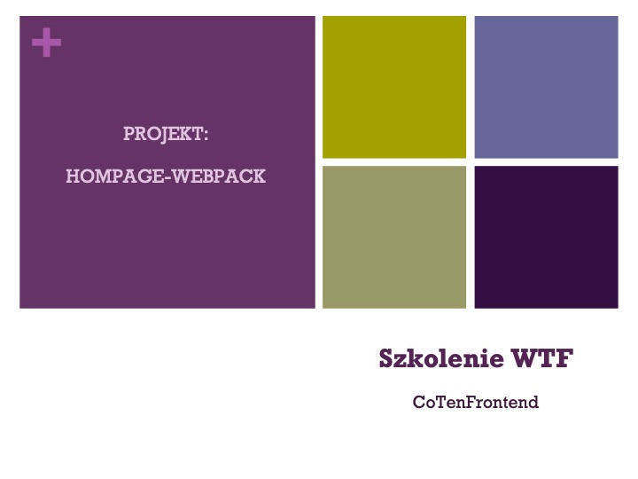

# Homepage Ani

Moja strona szkoleniowa.

## Jak to uruchomić?
Najpierw zrów `npm install`, a później masz następujące opcje:

`npm run start` - runs development mode

`npm run build` - runs build process for production

`npm run publish` - runs build process and publish the page using `gh-pages` branch

